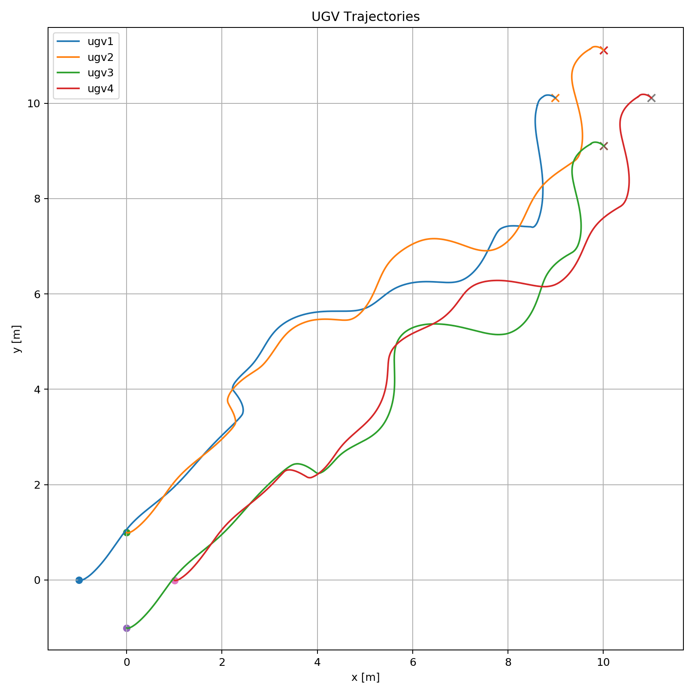
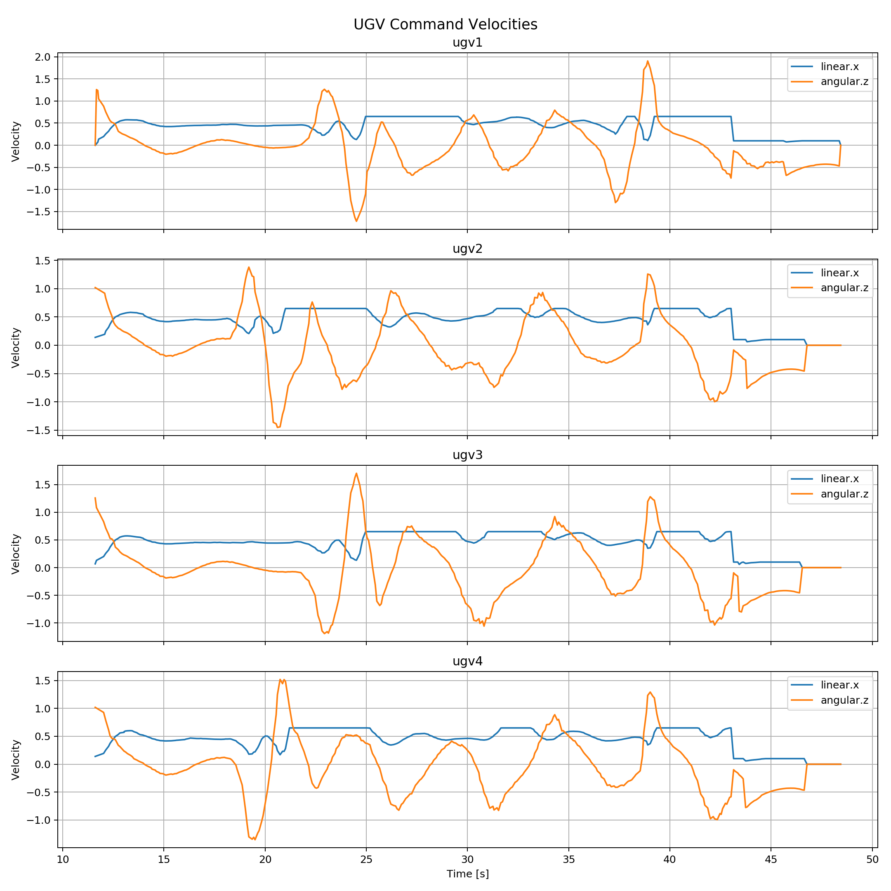

# Multi-Agent UGV Simulation

[](https://docs.ros.org/en/foxy/)
[](https://gazebosim.org/)
[](LICENSE)

A ROS 2 and Gazebo simulation of four unmanned ground vehicles moving as a coordinated formation with obstacle-aware formation adaptation.

## Overview

The project simulates four UGVs named `ugv1`, `ugv2`, `ugv3`, and `ugv4`.

The robots follow a shared virtual-leader trajectory while maintaining formation. When an obstacle intersects the formation corridor, the formation manager can adapt the formation by:

- shifting left
- shifting right
- splitting around the obstacle
- returning smoothly to the normal formation after the obstacle is passed

The project also provides RViz visualization, delayed obstacle spawning, and automatic trajectory and velocity plots.

## Features

- Multi-agent simulation with four UGVs
- ROS 2 Python control nodes
- Gazebo robot and world simulation
- RViz top-down swarm visualization
- Virtual-leader-based formation movement
- Adaptive obstacle avoidance using shift and split modes
- Configurable start, goal, speed, and obstacle parameters
- Automatic trajectory and velocity logging
- Timestamped result directories for each simulation run

## Example Results

<table>
  <tr>
    <th>UGV Trajectories</th>
    <th>UGV Velocities</th>
  </tr>
  <tr>
    <td>
      
    </td>
    <td>
      
    </td>
  </tr>
</table>

## Repository Structure

```text
multi-agent-ugv-sim/
├── src/
│   ├── ugv_control/
│   │   ├── config/
│   │   │   └── swarm_params.yaml
│   │   ├── launch/
│   │   │   └── control.launch.py
│   │   └── ugv_control/
│   │       ├── delayed_gazebo_obstacle_spawner.py
│   │       ├── formation_mode_manager.py
│   │       ├── global_obstacle_publisher.py
│   │       ├── single_agent_node.py
│   │       ├── swarm_plot_logger.py
│   │       └── swarm_visualizer.py
│   ├── ugv_description/
│   │   ├── rviz/
│   │   └── urdf/
│   └── ugv_gazebo/
│       ├── launch/
│       └── worlds/
├── README.md
└── LICENSE
```

## Packages

| Package | Purpose |
|---|---|
| `ugv_control` | Formation control, obstacle processing, visualization, and result logging |
| `ugv_description` | Robot description files and RViz configuration |
| `ugv_gazebo` | Gazebo world and multi-robot spawning launch files |

## Requirements

- Ubuntu 20.04
- ROS 2 Foxy
- Gazebo
- RViz 2
- Python 3
- Colcon

> ROS 2 Foxy has reached end-of-life and is no longer officially supported. This repository currently targets Foxy because that is the version used during development.

## Installation

### 1. Install the required packages

Install ROS 2 Foxy before continuing. Then install the additional dependencies:

```bash
sudo apt update

sudo apt install -y \
  ros-foxy-xacro \
  ros-foxy-gazebo-ros-pkgs \
  ros-foxy-gazebo-ros \
  ros-foxy-rviz2 \
  python3-colcon-common-extensions \
  python3-yaml \
  python3-matplotlib
```

### 2. Clone the repository

The repository is structured as a complete ROS 2 workspace.

```bash
cd ~

git clone https://github.com/andreikotkov/multi-agent-ugv-sim.git multi_ugv_ws

cd ~/multi_ugv_ws
```

### 3. Build the workspace

```bash
source /opt/ros/foxy/setup.bash

colcon build --symlink-install

source install/setup.bash
```

## Running the Simulation

Open two terminals.

### Terminal 1 - Start Gazebo and spawn the UGVs

```bash
source /opt/ros/foxy/setup.bash
source ~/multi_ugv_ws/install/setup.bash

ros2 launch ugv_gazebo multi_spawn.launch.py
```

### Terminal 2 - Start the controllers and visualization

```bash
source /opt/ros/foxy/setup.bash
source ~/multi_ugv_ws/install/setup.bash

ros2 launch ugv_control control.launch.py
```

The control launch file starts:

- one controller node for each of the four UGVs
- the formation mode manager
- the global obstacle publisher
- the delayed Gazebo obstacle spawner
- the swarm visualizer
- the swarm plot logger
- RViz 2

## Optional Bash Aliases

The following aliases can be added to `~/.bashrc` to make rebuilding and sourcing the workspace faster:

```bash
cat <<'EOF' >> ~/.bashrc

source /opt/ros/foxy/setup.bash
alias cb='cd ~/multi_ugv_ws && colcon build --symlink-install && source install/setup.bash'
alias sws='source ~/multi_ugv_ws/install/setup.bash'
EOF

source ~/.bashrc
```

After adding them:

```bash
cb
sws
```

## Configuration

The main simulation parameters are located in:

```text
src/ugv_control/config/swarm_params.yaml
```

Important parameters include:

| Parameter | Default | Description |
|---|---:|---|
| `vl_start_x`, `vl_start_y` | `0.0`, `0.0` | Virtual leader start position |
| `vl_goal_x`, `vl_goal_y` | `10.0`, `10.0` | Virtual leader goal position |
| `vl_speed` | `0.45` | Virtual leader maximum speed |
| `control_period` | `0.1` / `0.05` | Controller update period |
| `warmup_duration` | `2.0` | Delay before the swarm starts moving |
| `mode_enter_lookahead` | `0.8` | Obstacle look-ahead distance before changing formation |
| `mode_exit_lookahead` | `0.8` | Look-ahead distance while formation adaptation is active |
| `max_shift_amount` | `3.0` | Maximum lateral formation shift |
| `max_split_extra` | `2.0` | Maximum additional formation split |
| `obstacle_pass_clearance` | `0.8` | Clearance used to determine when an obstacle has been passed |
| `spawn_delay_sec` | `30.0` | Delay before the test obstacle is spawned |

After editing the parameters, rebuild and source the workspace:

```bash
cd ~/multi_ugv_ws
colcon build --symlink-install
source install/setup.bash
```

## Formation Modes

The formation manager uses four operating modes:

| Mode | Behavior |
|---|---|
| `normal` | Maintains the nominal UGV formation |
| `shift_left` | Moves the complete formation to the left of an obstacle |
| `shift_right` | Moves the complete formation to the right of an obstacle |
| `split` | Expands or separates the formation around a central obstacle |

The shift or split amount is calculated dynamically from the obstacle position, obstacle size, robot dimensions, and configured safety margin.

## Generated Results

The `swarm_plot_logger` records the simulation and creates a timestamped output directory in the workspace.

Example:

```text
test_run_2026-04-06_09-25-15/
├── trajectories_all_ugvs.png
└── velocities_all_ugvs.png
```

These plots show:

- the trajectories of all UGVs
- linear and angular velocity histories
- the motion of the swarm during formation adaptation

## Troubleshooting

### Package not found

Source both ROS 2 and the workspace:

```bash
source /opt/ros/foxy/setup.bash
source ~/multi_ugv_ws/install/setup.bash
```

### Changes are not visible

Rebuild the workspace:

```bash
cd ~/multi_ugv_ws
colcon build --symlink-install
source install/setup.bash
```

### Gazebo starts but the controllers do not move the robots

Start the Gazebo launch file first and wait until all four robot models are spawned before starting the control launch file.

### RViz does not display the swarm correctly

Confirm that the fixed frame is set to `map` and that simulation time is enabled.

## Author

**Andrei Kotkov**

## License

This project is licensed under the Apache License 2.0. See the [`LICENSE`](LICENSE) file for details.
